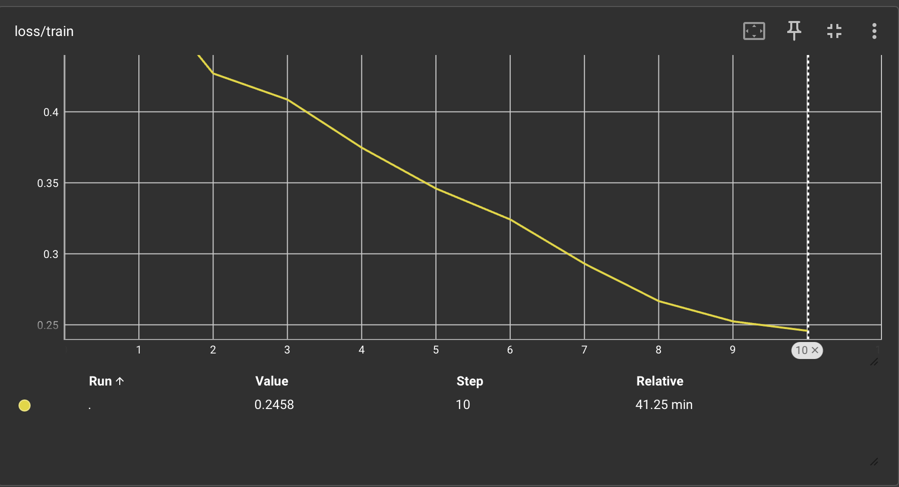
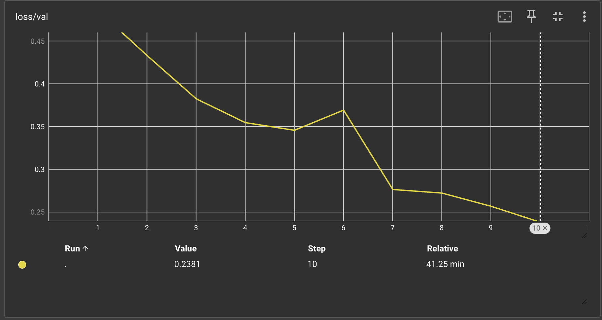
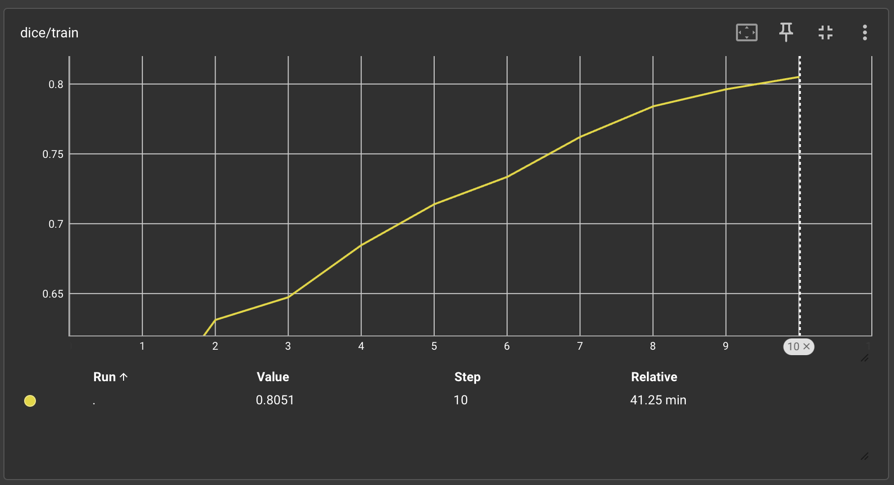
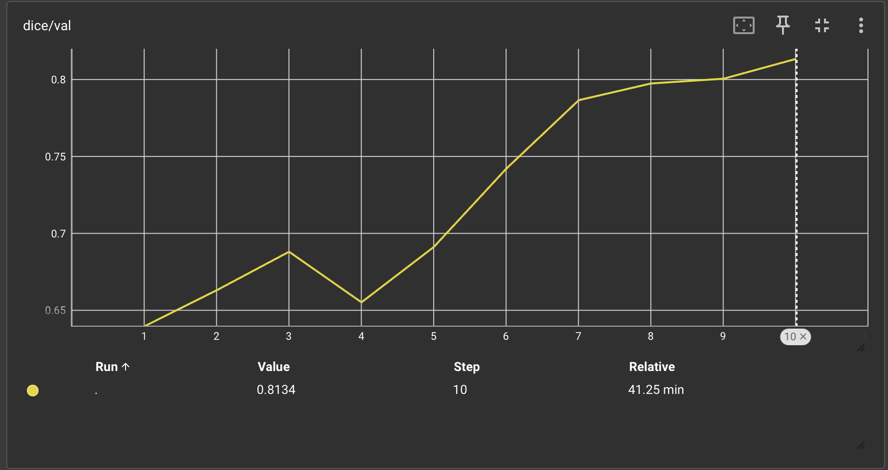
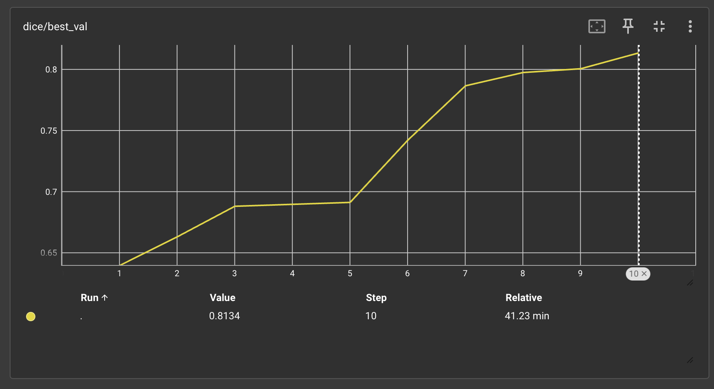
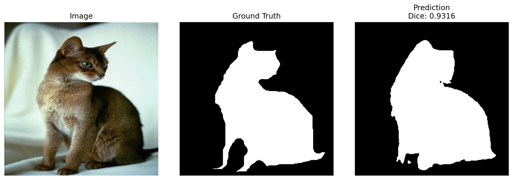
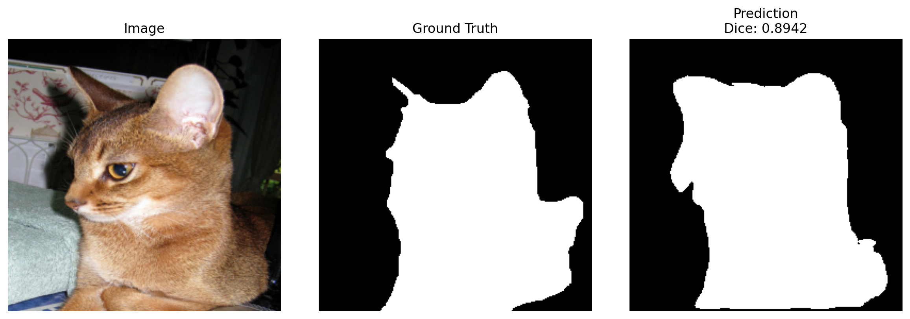

# UNet

Minimal U-Net project for binary pet segmentation on the Oxford-IIIT Pet dataset.

## Quickstart

```bash
uv sync
uv run python src/train.py --epochs 10 --batch-size 8 --num-workers 4
```

The dataset is downloaded automatically into `data/` on first run.

TensorBoard:

```bash
uv run tensorboard --logdir runs/unet
```

Run inference on selected test images:

```bash
uv run python src/test_model.py --checkpoint checkpoints/unet_best.pt --sample-idxs 0 5 12
```

Outputs:
- checkpoint: `checkpoints/unet_best.pt`
- TensorBoard logs: `runs/unet`
- prediction previews: `outputs/predictions/`

## Results

### Training Curves

<p align="center">
  
  
</p>

<p align="center">
  
  
</p>

<p align="center">
  
</p>

### Examples

<p align="center">
  
</p>

<p align="center">
  
</p>
